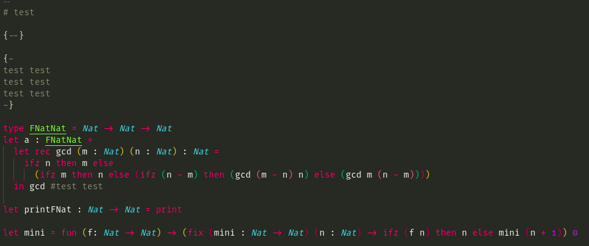

# FD4 Syntax Highlighting

Un highlighting simple para el lenguaje FD4 usado en la materia de compiladores de la carrera LCC

## Instalación

### Desde VSCODE

La extensión se encuentra publicada en el marketplace de vscode por lo cual puede simplemente instalarse como cualquier otra extensión

### Manualmente

La instalación también puede hacerse manualmente, solo hay que copiar/clonar el repo en 

`~/.vscode/extensions` (Linux)

`%USERPROFILE%\.vscode\extensions` (Windows)

No tengo plata como para ver donde es en MAC pero me imagino que te podes dar cuenta viendo como es en los otros

## Ejemplo

Este es un ejemplo de como se ve el highlighting de la extensión

